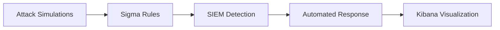

# 🛡️ SOC Analyst Project
### Threat Detection, Simulation, Automation & SIEM Integration

<div align="center">

[](https://choosealicense.com/licenses/mit/)
[](https://www.elastic.co/)
[](https://github.com/SigmaHQ/sigma)
[](https://attack.mitre.org/)

**Built by [Anurag Aditya](https://www.linkedin.com/in/anurag-aditya-soc)**

</div>

---
This project demonstrates a **comprehensive Security Operations Center (SOC)** setup designed to enable **real-time threat detection**, automated responses, and seamless **SIEM (Security Information and Event Management)** integration. The project includes **Sigma detection rules**, attack simulations, and a variety of tools for automating security workflows, providing hands-on experience with industry-standard SOC practices.

---

## Project Overview

The **SOC Analyst Project** integrates multiple components to monitor, detect, and respond to various security incidents. Key features include:

- **Sigma Detection Rules**: Detection of attacks such as **Brute Force**, **Process Injection**, and **Suspicious DNS Queries** using Sigma format.
- **Attack Simulations**: Realistic simulations of common attack scenarios that help test the detection capabilities.
- **Automated Response**: Scripts that automatically block malicious IPs or take other predefined actions when an attack is detected.
- **SIEM Integration**: Configuration and use of **Elastic Stack** (Elasticsearch, Kibana) to collect, analyze, and visualize data in real time.
- **Comprehensive Documentation**: Full documentation explaining the project structure, setup, and execution.


### 🔑 What Makes This Project Unique?



---

## Features

- **Sigma Detection Rules**  
  - Detect Brute Force login attempts, Process Injection, Suspicious DNS Queries, and more.
  - Built in the Sigma YAML format, easily adaptable to various SIEM systems.

- **Attack Simulations**  
  - Simulate **Brute Force Attacks**, **Process Injection**, and **Data Exfiltration** to test detection systems.
  - Scripts include both **PowerShell** and **Bash** variations for cross-platform testing.

- **Automated Response**  
  - Implement automation scripts for blocking malicious IP addresses or triggering alerts upon attack detection.

## 🏗️ Architecture

```
┌─────────────────┐
│ Attack Sources  │
└────────┬────────┘
         │
         ▼
┌─────────────────┐      ┌──────────────┐
│  Sigma Rules    │─────▶│ Elastic SIEM │
│  Detection      │      │  (ELK Stack) │
└─────────────────┘      └──────┬───────┘
                                │
                                ▼
                    ┌───────────────────────┐
                    │ Automated Response    │
                    │ • IP Blocking         │
                    │ • Alerting            │
                    │ • Incident Logging    │
                    └───────────────────────┘
```

## SIEM Integration

This project uses the **Elastic Stack (Elasticsearch, Logstash, Kibana)** for centralized logging and threat detection.

- Logs generated from simulated attacks are forwarded to **Elasticsearch** via configured pipelines.
- **Kibana dashboards are manually built** from these logs after the attack simulations.
- These dashboards help in visualizing attack patterns, detection alerts, and overall security posture.
- ⚠️ **Note**: Dashboards are not pre-exported in this repository.

- **Reporting & Documentation**  
  - Complete project documentation, including installation instructions, setup guides, and a detailed report on attack simulations and testing results.

---

## Installation & Setup

### Prerequisites

- **Elastic Stack (Elasticsearch, Logstash, Kibana)** for SIEM functionality.
- **PowerShell** for running attack simulations on Windows.
- **Bash** for attack simulations on Linux/macOS.

### Steps to Run

1. **Clone the repository**:
   ```bash
   git clone https://github.com/Acelake123/SOC-Analyst-Project-main.git
   cd SOC-Analyst-Project-main

2. **Set up Elastic Stack**:

   * Follow the [Elastic Stack setup instructions](https://www.elastic.co/guide/en/elastic-stack-get-started/current/get-started-elastic-stack.html).
   * Use the configuration files in the `SIEM-Config` folder.

3. **Run Attack Simulations**:
   Navigate to the `Attack-Simulations/` folder and execute scripts. Example:

   ```bash
   bash brute_force_attack.sh
   ```

4. **Deploy Sigma Rules**:
   Import YAML rules from `Sigma-Rules/` into Kibana or your SIEM platform.

5. **Automate Responses**:
   Use automation scripts from `Automation-Scripts/` like `block_ip.sh` to mitigate threats.

6. **View Results in Kibana**:
   Access Kibana dashboards to visualize alert data.

---

## Sample Detection Alerts

Here are examples of detection alerts generated during the simulations:

### 🚨 Brute Force Attack

```yaml
Alert Name: Brute Force Attempt Detected
Event ID: 4625
Account Name: user123
Target User: user123
Failure Reason: Unknown user name or bad password
Source IP: 192.168.1.101
Level: High
Tags: attack.mitre, attack.t1110
```

---

### 🧬 Process Injection

```yaml
Alert Name: Suspicious Process Injection Detected
Event ID: 4688
Parent Process: explorer.exe
Injected Process: powershell.exe
Command Line: powershell -enc <encoded>
User: WIN-ADMIN
Source IP: 10.0.0.12
Level: Critical
Tags: attack.mitre, attack.t1055
```

---

### 🌐 Suspicious DNS Query

```yaml
Alert Name: Suspicious DNS Query
Event ID: 5156
Queried Domain: h4x0r.evil-domain.xyz
Query Type: A
Source Process: chrome.exe
Source IP: 172.16.5.30
Level: Medium
Tags: attack.mitre, attack.t1071
```

---

### 📤 Data Exfiltration Attempt

```yaml
Alert Name: Possible Data Exfiltration
Event ID: 4670
File Accessed: /var/log/secure.zip
Transfer Method: curl to pastebin.com
User: root
Destination IP: 104.26.10.78
Level: High
Tags: attack.mitre, attack.t1041
```

---


## Project Structure

```
SOC-Analyst-Project/
├── Sigma-Rules/
│   ├── brute_force.yml
│   ├── process_injection.yml
│   └── suspicious_dns_queries.yml
├── Attack-Simulations/
│   ├── brute_force_attack.sh
│   ├── process_injection_attack.ps1
│   └── exfiltration_attack.sh
├── Automation-Scripts/
│   └── block_ip.sh
├── Documentation/
│   ├── README.md
│   └── project_report.md
├── SIEM-Config/
│   └── elasticsearch_config.yml
├── .gitignore
└── LICENSE
```

---

## Testing & Results

### Simulated Attacks:

* **Brute Force**: Triggered using Hydra. Detected by `brute_force.yml`.
* **Process Injection**: Injected using PowerShell. Detected by `process_injection.yml`.
* **DNS Abuse**: Queried suspicious domain. Detected by `suspicious_dns_queries.yml`.

### Response Automation:

* **IP Blocking**: Malicious IPs blocked using custom automation scripts.
* **Alerting**: Real-time alerts sent and visualized in Kibana.

---

## License

This project is licensed under the **MIT License** – see the [LICENSE](LICENSE) file.

---

## Conclusion

The **SOC Analyst Project** equips learners and professionals with practical skills to monitor and defend modern IT environments. From detection rules to simulation scripts and SIEM dashboards, this hands-on setup mirrors real-world SOC operations.

---

## 📞 Contact

<div align="center">

### **Anurag Aditya**

[](https://www.linkedin.com/in/anurag-aditya-soc)
[](https://github.com/Acelake123)
[](mailto:adityaanurag424@gmail.com)

</div>

---

<div align="center">

### ⭐ Star this repository if you found it helpful!

**Built with 💙 for the cybersecurity community**

</div>
